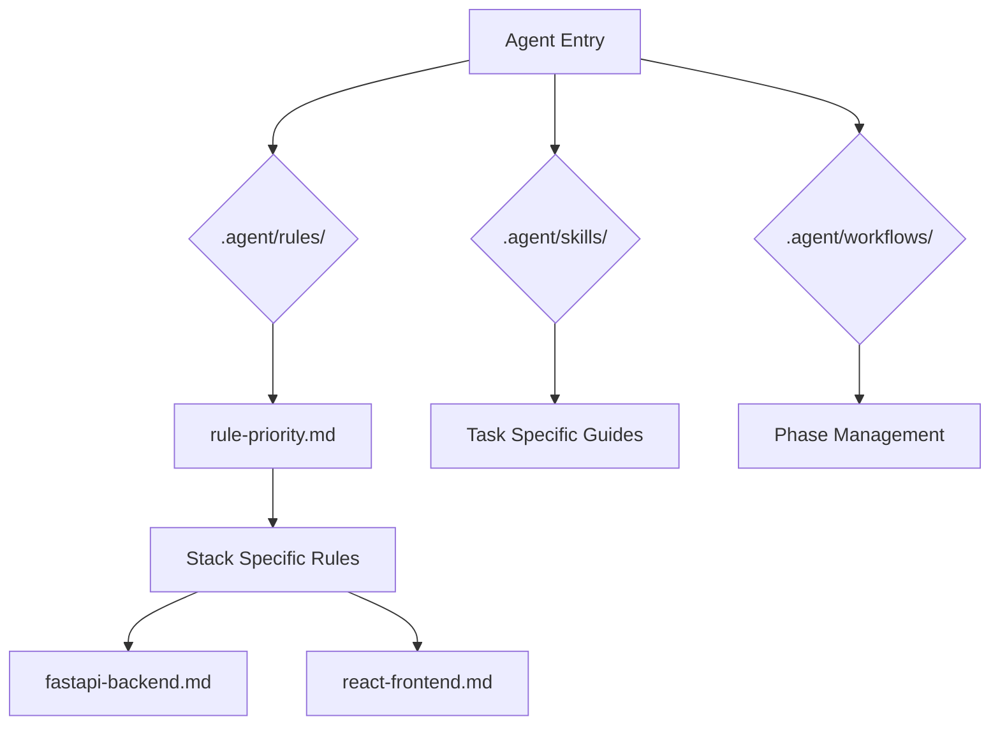

# Architecture: FastAPI-React .agent Configuration

**Author**: Winston (Architect)
**Date**: 2026-03-12

## 1. Overview
The `.agent` folder for the `fastapi-react` stack provides the intelligence layer for AI agents. It ensures that any agent working on this stack follows the BMAD methodology, the "Clean Slate" architecture, and modern React best practices.

## 2. Component Design

### Rules (`.agent/rules/`)
- **`rule-priority.md`**: Defines the hierarchy of rule enforcement.
- **`security-mandate.md`**: FastAPI and React security (CORS, JWT, XSS protection).
- **`docker-commands.md`**: Mappings for `./dc.sh` commands (e.g., `npm run dev` vs `pytest`).
- **`fastapi-backend.md`**: Pydantic v2, Dependency Injection, and Async patterns.
- **`react-frontend.md`**: [NEW] Hooks API, Functional Components, Co-location of styles/tests, and Vite HMR.
- **`testing-strategy.md`**: Vitest for frontend, Pytest for backend.

### Skills (`.agent/skills/`)
- **`debugging-protocol/`**: Commands for inspecting FastAPI logs and Vite overlay errors.
- **`guardrails/`**: Pre-commit checklist for multi-stack consistency.
- **`react-crud/`**: [NEW] Guide for creating features with `services/`, `hooks/`, and `components/`.

### Workflows (`.agent/workflows/`)
- Standard BMAD 8-agent lifecycle.
- **`2-implement.md`**: Red-Green-Refactor loop using `vitest --watch`.
- **`align-stack.md`**: Utility to verify the skeleton is intact.

## 3. Data Flow & Integration
The configuration assumes a standard multi-service Docker Compose setup:
- `backend`: Port 8000
- `frontend`: Port 5173 (Vite default)

Internal cross-references will use the `@filename.md` convention to ensure agents can discover related rules during any phase.

## 4. Mermaid Diagram: Configuration Discovery

