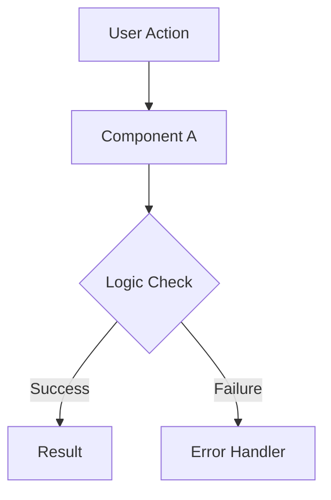

# [Feature Name] — Implementation Specification

## 📊 Overview

### Purpose
[Briefly describe why this feature exists and what problem it solves.]

### Key Principle
[State the core philosophy of this implementation, e.g., "Privacy first," "Zero-latency," etc.]

### User Experience
[Describe the journey from the user's perspective.]

---

## 🎯 Design Principles
- [Principle 1]: [Description]
- [Principle 2]: [Description]

---

## 📐 Architecture Design

### Data Flow / Logic Flow

### Database Schema / Data Structure
[Describe any changes to the data layer.]

---

## 🔧 Implementation Details

### Phase 1: [Phase Name]
- [ ] [Step 1]
- [ ] [Step 2]

### Phase 2: [Phase Name]
- [ ] [Step 1]

---

## 📡 API Reference

### [Endpoint Name]
- **Method**: `GET` / `POST` ...
- **Path**: `/api/v1/...`
- **Request Body**: `JSON` / `Form` ...
- **Response**: `200 OK` / `400 Bad Request` ...

---

## ✅ Implementation Checklist
- [ ] Unit tests cover core logic
- [ ] Integration tests verify cross-component flow
- [ ] Documentation updated
- [ ] Security audit performed (no credentials!)

---

## 📊 Example Scenarios

### Scenario 1: [Scenario Description]
[Detail the input, processing, and expected output.]

---

## 🔮 Future Enhancements
- [Idea 1]
- [Idea 2]
