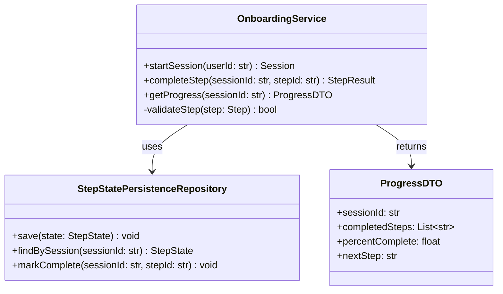
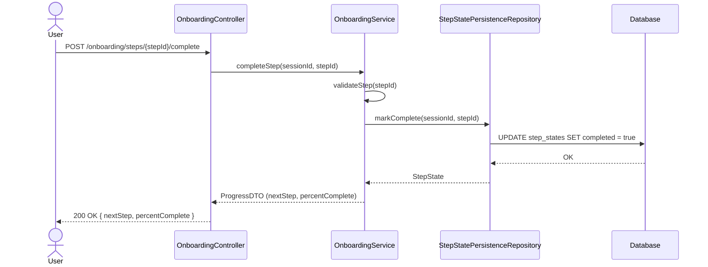
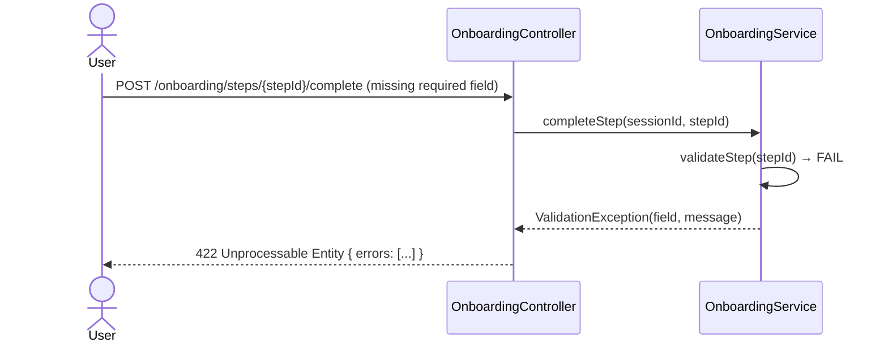
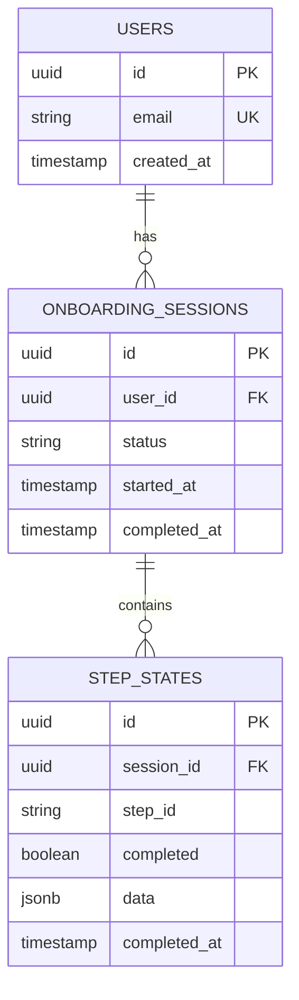

# LLD — [Feature / Component / Service Name]

> **Stage 3 of 3 — Documentation Hierarchy**
> Owner: Tech Lead / Senior Engineer | Target Location: `docs/lld/{feature}_lld.md` | References: `docs/prd/[PRD_NAME].md`
> Status: `Draft` | `In Review` | `Approved`
> Design Review: _[Reviewer Name, Date]_ | Open Questions Remaining: `0`

---

## 1. Overview & Scope

**Component / Module**:
[The specific component, service, or module being designed. e.g., "OnboardingWizardService + StepStatePersistenceRepository"]

**PRD References**:
[Exact FR numbers this LLD implements. e.g., FR-001, FR-002, FR-003]

**Out of Scope for this LLD**:
[e.g., "Mobile rendering (handled in separate LLD-MOBILE.md)"]

**SOLID Compliance Commitment**:
This design adheres to SOLID principles. Each section notes relevant principle compliance.

---

## 2. Component & Class Design

> Use UML class diagrams (Mermaid). Follow Single Responsibility Principle — one class, one job.



**Class Responsibilities**:
| Class | Responsibility | SOLID Principle |
|-------|---------------|-----------------|
| `OnboardingService` | Orchestrates onboarding step flow and validation | SRP — single domain concern |
| `StepStatePersistenceRepository` | Data access only — no business logic | SRP + DIP (depends on abstraction) |
| `ProgressDTO` | Data transfer object — immutable, no methods | SRP |

---

## 3. Sequence Diagrams

> Show the interaction between components over time for key flows.

### 3.1 Complete a Step (Happy Path)



### 3.2 Step Validation Failure



---

## 4. API Contracts

> Every public endpoint. Request/response schemas must be unambiguous and versioned.

### `POST /api/v1/onboarding/steps/{stepId}/complete`

**Purpose**: Mark a specific onboarding step as complete.

**Path Parameters**:
| Param | Type | Required | Description |
|-------|------|----------|-------------|
| `stepId` | string | Yes | Step identifier (e.g., `profile-setup`) |

**Request Headers**:
| Header | Required | Value |
|--------|----------|-------|
| `Authorization` | Yes | `Bearer <jwt_token>` |
| `Content-Type` | Yes | `application/json` |

**Request Body**:
```json
{
  "sessionId": "sess_abc123",
  "data": {
    "fullName": "Jane Doe",
    "timezone": "Asia/Singapore"
  }
}
```

**Success Response** `200 OK`:
```json
{
  "sessionId": "sess_abc123",
  "completedSteps": ["profile-setup"],
  "percentComplete": 20.0,
  "nextStep": "preferences"
}
```

**Error Responses**:
| Status | Code | Scenario |
|--------|------|----------|
| `422` | `VALIDATION_ERROR` | Required fields missing or invalid |
| `404` | `SESSION_NOT_FOUND` | Session ID does not exist |
| `409` | `STEP_ALREADY_COMPLETE` | Step was already marked complete |
| `500` | `INTERNAL_ERROR` | Unexpected server error |

---

## 5. Database Schema

> Full table definitions with indexes. Use ER diagrams.



**Index Strategy**:
| Table | Index | Type | Rationale |
|-------|-------|------|-----------|
| `onboarding_sessions` | `(user_id)` | B-Tree | Lookup sessions by user |
| `step_states` | `(session_id, step_id)` | Composite B-Tree | Fast step lookup per session |
| `step_states` | `(session_id)` | B-Tree | Fetch all steps for a session |

**Migration Notes**:
[Describe backwards-compatible migration strategy. e.g., "Add `data jsonb` column with default `{}`. No destructive changes."]

---

## 6. Logic & Algorithms

> Pseudocode for non-trivial business logic. Don't document what is obvious.

### Step Completion Validation

```
FUNCTION validateStep(step, data):
    IF step.requiredFields is not empty:
        FOR each field in step.requiredFields:
            IF field not present in data OR data[field] is empty:
                RAISE ValidationException(field, "Field is required")

    IF step.customValidator exists:
        result = step.customValidator(data)
        IF result.isInvalid:
            RAISE ValidationException(result.field, result.message)

    RETURN valid
```

### Progress Calculation

```
FUNCTION calculateProgress(session):
    totalSteps = TOTAL_STEPS_COUNT  // constant, loaded from config
    completedSteps = COUNT(step_states WHERE session_id = session.id AND completed = true)
    RETURN (completedSteps / totalSteps) * 100
```

---

## 7. Design Patterns

> Only document patterns that genuinely solve a problem. Justify each choice.

| Pattern | Where Applied | Rationale |
|---------|--------------|-----------|
| **Repository Pattern** | `StepStatePersistenceRepository` | Decouples business logic from database technology. Allows swapping DB (e.g., Redis → PostgreSQL) without changing `OnboardingService`. |
| **DTO (Data Transfer Object)** | `ProgressDTO` | Prevents leaking internal domain models to the API layer. Improves stability of the API contract. |
| **Strategy Pattern** | Step validators | Each step can have its own validation strategy injected, enabling extension without modifying the core service (Open/Closed Principle). |

---

## 8. Error Handling & Edge Cases

| Scenario | Detection | Response | Fallback |
|----------|-----------|----------|----------|
| Database unavailable | Connection timeout > 3s | 503 Service Unavailable + alert | Retry with exponential backoff (max 3 attempts) |
| Step already completed | DB constraint / query check | 409 Conflict | Return current progress state, no error surfaced to user |
| Session expired | JWT expiry check | 401 Unauthorized | Redirect to login, session resumed after re-auth |
| Invalid `stepId` | Enum validation | 422 Unprocessable Entity | Return valid step IDs in error body |
| Concurrent duplicate requests | Idempotency key per request | First succeeds, duplicates return cached 200 | — |

---

## 9. Non-Functional Design Decisions

**Performance**:
- Step completion API target: < 200ms p95. DB write is the bottleneck → use connection pooling (min: 5, max: 20).
- Progress read is cached in Redis (TTL: 30s) to avoid DB reads on every page load.

**Security**:
- All user-supplied `data` in step completion is validated and sanitized server-side.
- `session_id` is a UUID — not guessable. Validated against authenticated `user_id` on every request.
- No PII stored in `data` column beyond what is explicitly required.

**Observability**:
- Emit structured log on every `completeStep` call: `{ sessionId, stepId, userId, duration_ms, success }`.
- Prometheus counter: `onboarding_step_completions_total{step, status}`.
- Alert: if error rate > 5% over 5 minutes, page on-call.

---

## Exit Criterion

> [!IMPORTANT]
> This LLD MUST be reviewed in a tech design review session. No open questions may remain before tickets are written.

**Design Review Checklist**:
- [ ] All FR-xxx references from the PRD are addressed
- [ ] Sequence diagrams reviewed for correctness
- [ ] Database schema reviewed by DBA / senior engineer
- [ ] API contracts are stable (no breaking changes expected in v1)
- [ ] Error handling covers all known failure modes
- [ ] SOLID principles applied and documented
- [ ] No open questions remain
- [ ] Reviewer sign-off recorded at the top of this document
