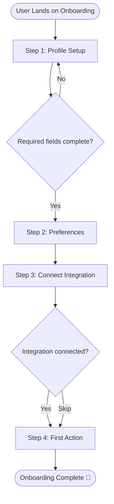

# PRD — [Initiative / Epic Name]

> **Stage 2 of 3 — Documentation Hierarchy**
> Owner: PM + Design Lead | Target Location: `docs/prd/{initiative}_prd.md` | References: `docs/briefs/[PRODUCT_BRIEF_NAME].md`
> Status: `Draft` | `In Review` | `Approved`
> Sign-off: Engineering Lead: _[Name, Date]_ | Design Lead: _[Name, Date]_

---

## 1. Overview

**One-liner**:
[A single sentence that describes what this is. e.g., "A comprehensive Agent Memory System supporting short-term, long-term, and vector retrieval capabilities."]

**Brief / Problem Reference**:
[Link or reference to the approved Product Brief that preceded this PRD. e.g., `docs/briefs/agentmaster_v2_brief.md`]

**What we are building** (What):
[1–3 sentences describing the solution at a high level. Focus on the initiative/epic scope as a whole, covering 3-8 features.]

**Why now** (Strategic context):
[Reiterate the business urgency from the brief in 1–2 sentences.]

---

## 2. Goals & Success Metrics

> Connect every feature to a business outcome. Shipping is not success — metric movement is.

| Goal | Success Metric | Baseline | Target | Owner |
|------|---------------|----------|--------|-------|
| [e.g., Increase activation] | [e.g., Onboarding completion rate] | [45%] | [70%] | [PM] |
| [e.g., Reduce support load] | [e.g., Onboarding-related tickets/week] | [120] | [<40] | [PM] |

**Anti-Goals** (what we will NOT optimize for):
- [e.g., "We are not optimizing for power-user workflows in v1."]

---

## 3. Target Users & Personas

| Persona | Job-to-be-Done | Key Frustration | v1 Priority |
|---------|---------------|-----------------|-------------|
| [Name]  | [e.g., "Set up account quickly to try the core feature"] | [e.g., "Too many steps before value is delivered"] | Primary |

**User Research References**:
[Link to user interviews, usability sessions, or survey data that informed this PRD.]

---

## 4. User Stories

> Format: "As a **[persona]**, I want **[goal]** so that **[reason/value]**."
> Each story must map to at least one Functional Requirement (FR-xxx).

| ID | User Story | Priority (MoSCoW) | FR Reference |
|----|-----------|-------------------|--------------|
| US-001 | As a **new user**, I want to complete setup in under 3 minutes so that I can experience value before losing interest. | Must Have | FR-001, FR-002 |
| US-002 | As a **returning user**, I want to skip steps I've already completed so that I don't repeat myself. | Should Have | FR-003 |

---

## 5. Functional Requirements

> Numbered, unambiguous, and testable. Each requirement must be linked to a user story.

| ID | Requirement | User Story | Priority |
|----|-------------|------------|----------|
| FR-001 | The system MUST display a step-by-step progress indicator with percentage completion. | US-001 | Must Have |
| FR-002 | The system MUST allow the user to complete onboarding in no more than 5 discrete steps. | US-001 | Must Have |
| FR-003 | The system MUST persist step completion state across sessions so returning users resume where they left off. | US-002 | Should Have |
| FR-004 | The system SHOULD allow skipping optional steps with a visible "Skip" control. | US-002 | Should Have |

---

## 6. Non-Functional Requirements

| Category | Requirement | Metric |
|----------|-------------|--------|
| **Performance** | API response time for step validation | < 200ms (p95) |
| **Availability** | Onboarding service uptime | 99.9% SLA |
| **Security** | All user input sanitized and validated server-side | Zero injection vulnerabilities |
| **Accessibility** | WCAG 2.1 AA compliance on all onboarding screens | Lighthouse a11y score ≥ 90 |
| **Scalability** | Support concurrent onboarding sessions | 10,000 concurrent users |

---

## 7. User Flows & Wireframes

> At minimum, provide a Mermaid flow diagram. Link to Figma/wireframes if available.

### Primary Flow (Happy Path)



**Figma / Wireframe Reference**: [Link to design file]

### Wireframes & Layouts (If Needed)

```text
+-----------------------------------------------------------+
| [Logo]                    [Search Input]       [Profile]  |
+-----------------------------------------------------------+
| Sidebar        | Main Dashboard Panel                     |
| - Overview     |                                          |
| - Settings     | [Metric Card 1]   [Metric Card 2]        |
| - Users        | +--------------------------------------+ |
|                | | Interactive Data Chart / Flow Graph  | |
|                | +--------------------------------------+ |
+-----------------------------------------------------------+
```

### Error / Edge Case Flows

```mermaid
flowchart TD
    A[Step 3: Connect Integration] --> B{API call fails?}
    B -- Yes --> C[Show error banner with retry CTA]
    C --> D{Retry successful?}
    D -- Yes --> E[Proceed to Step 4]
    D -- No --> F[Offer "Skip for now" option]
```

---

## 8. Scope

**v1 — In Scope**:
- [Capability 1]
- [Capability 2]

**v1 — Explicitly Out of Scope**:
- [e.g., "Mobile app onboarding (web only for v1)"]
- [e.g., "A/B test variations (post-launch optimization)"]

**Dependencies**:
| Dependency | Team | Required By | Risk |
|------------|------|-------------|------|
| [e.g., Auth service API v2] | [Platform] | [Sprint 3] | [High — blocking] |

---

## 9. Assumptions & Constraints

**Assumptions**:
- [ ] [e.g., "Users have a valid email at sign-up."]
- [ ] [e.g., "The backend team can deliver the step-state persistence API by Sprint 2."]

**Open Questions** (must be resolved before LLD begins):
- [ ] [e.g., "Does legal require explicit consent before collecting profile data?"]
- [ ] [e.g., "Should incomplete onboarding be treated as a conversion event in analytics?"]

---

## 10. Epic & Ballpark Estimation

> Provide ballpark estimates in developer hours. Break complex tasks down so that no individual task exceeds 16 hours (2 days).

### Milestone 1: [e.g., Core API & Database Migration]
- Confidence Level: [High / Medium / Low]
- Dependencies: [e.g., None]

| Task ID | Component & Description | Est. Hours (Min - Max) | Priority |
|---------|-------------------------|------------------------|----------|
| T-001   | [e.g., DB Schema Migration for User Status] | 4h - 8h | Must Have |
| T-002   | [e.g., PUT /user/status API Route & Validation] | 8h - 12h | Must Have |

### Milestone 2: [e.g., Frontend Implementation & Integration]
- Confidence Level: [Medium]
- Dependencies: [Milestone 1 APIs]

| Task ID | Component & Description | Est. Hours (Min - Max) | Priority |
|---------|-------------------------|------------------------|----------|
| T-003   | [e.g., Setup component layout and sidebar state] | 6h - 10h | Must Have |
| T-004   | [e.g., Integrate endpoints with error handling UX] | 8h - 16h | Must Have |

*Note: Total ballpark development estimation includes a +20% integration buffer for testing and QA.*

---

## 11. Change Log

| Version | Date | Author | Changes |
|---------|------|--------|---------|
| 0.1 | [Date] | [PM] | Initial draft |
| 0.2 | [Date] | [PM + Design] | Added wireframes, refined FR-003 |

---

## Exit Criterion

> [!IMPORTANT]
> This PRD MUST be signed off by both the Engineering Lead and Design Lead before LLD begins. No tickets may be created until this is complete.

**Sign-off Checklist**:
- [ ] All functional requirements are testable and unambiguous
- [ ] All user stories have acceptance criteria (at story level)
- [ ] Engineering Lead has reviewed feasibility
- [ ] Design Lead has reviewed user flows and wireframes
- [ ] Open questions from Brief are resolved or tracked
- [ ] Scope boundary is agreed upon by all leads
