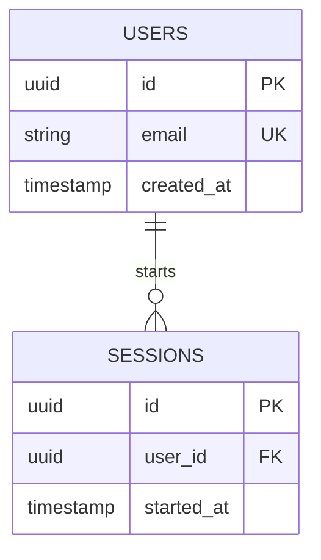

# System Architecture Map — [System Name]

> **Global Index & Shared Component Registry**
> Owner: Winston (Architect) | References: `docs/lld/`
> Status: `Living Document` | Last Sync: _[Date]_

---

## 1. System Summary

**Global Tech Stack**:
- **Frontend**: [e.g., React + Vite, Next.js, Streamlit]
- **Backend API**: [e.g., FastAPI, Node Express, Laravel]
- **Database(s)**: [e.g., PostgreSQL, Redis, MongoDB]
- **Deployment & Hosting**: [e.g., Docker, AWS ECS, GCP Cloud Run]

---

## 2. Component & Module Registry

> Document the top-level directories, module boundaries, and which LLD documents them.

| Component Name | Directory Location | Responsibility | Primary LLD |
|----------------|--------------------|----------------|-------------|
| [e.g., Web API] | `backend/app/` | FastAPI server endpoints & core logic | `docs/lld/api_gateway_lld.md` |
| [e.g., Memory DB] | `backend/memory/` | Short-term and long-term agent memory modules | `docs/lld/agent_memory_lld.md` |
| [e.g., UI Web] | `frontend/src/` | Next.js frontend pages and widgets | `docs/lld/user_interface_lld.md` |

---

## 3. Global Database Schema (Shared Entities)

> Show the core tables or shared collections here. Feature LLDs should import/link to these definitions instead of duplicating them.



---

## 4. Shared API Standards & Prefixes

**API Base URL**: `/api/v1`

**Global Headers**:
- `Authorization: Bearer <JWT>`
- `Content-Type: application/json`

**Standard Error Payload**:
```json
{
  "success": false,
  "error": {
    "code": "ERROR_CODE_NAME",
    "message": "Human readable reason",
    "details": {}
  }
}
```

---

## 5. Granular LLD Registry

> Index of all active Low-Level Designs.

- [ ] [Feature Name 1](file:///absolute/path/to/docs/lld/feature1_lld.md) — Covers [Requirements]
- [ ] [Feature Name 2](file:///absolute/path/to/docs/lld/feature2_lld.md) — Covers [Requirements]

---

## Retrospective Spike Log (Spike Retrofits)

> Record any experimental spikes merged into main. Ensure they have matching retrofitted PRDs and LLDs.

| Spike Name | Branch | Retrospective PRD | Retrospective LLD | Sign-Off Date |
|------------|--------|-------------------|-------------------|---------------|
| [e.g., Vector DB spike] | `spike/vector-db` | `docs/prd/vector_search_prd.md` | `docs/lld/vector_search_lld.md` | 2026-05-28 |
